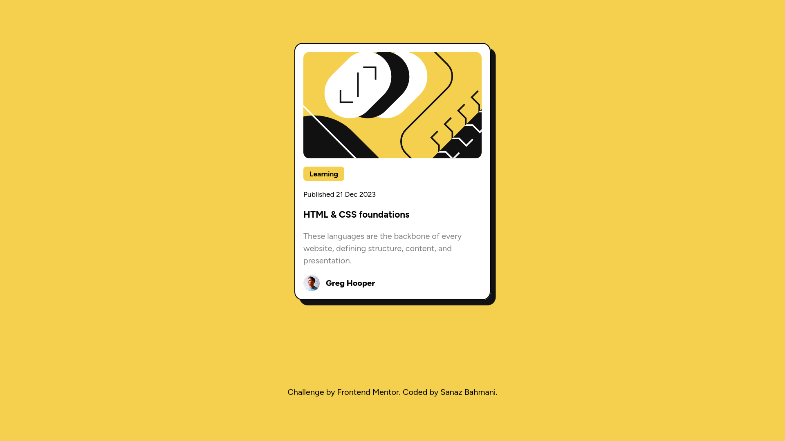

# Frontend Mentor - Blog preview card solution

This is a solution to the [Blog preview card challenge on Frontend Mentor](https://www.frontendmentor.io/challenges/blog-preview-card-ckPaj01IcS). Frontend Mentor challenges help you improve your coding skills by building realistic projects.

## Table of contents

- [Overview](#overview)
  - [The challenge](#the-challenge)
  - [Screenshot](#screenshot)
  - [Links](#links)
- [My process](#my-process)
  - [Built with](#built-with)
  - [What I learned](#what-i-learned)
  - [Useful resources](#useful-resources)
- [Author](#author)

## Overview

### The challenge

Users should be able to:

- See hover and focus states for all interactive elements on the page

### Screenshot



### Links

- Live Site URL: [Add live site URL here](https://your-live-site-url.com)

## My process

### Built with

- Semantic HTML5 markup
- [Tailwindcss](https://tailwindcss.com/) - For styles
- Flexbox
- CSS Grid
- Mobile-first workflow

### What I learned

Only when I started to prepare myself to take LinkedIn's Skill Assessment Test for HTML5 did I found out that the team had decided to completely remove it. However, I tried to build out this challenge using as much semantic tags as I can think of.

It was my very first time using html `<time>` tag:

```html
<p>Published <time>21 Dec 2023</time></p>
```

### Useful resources

- [HTML Semantic Cheatsheet](https://learntheweb.courses/topics/html-semantics-cheat-sheet/) - I utilized this cheatsheet whenever I wanted to check the exact semantic of a piece of information I wanted to display.

## Author

- LinkedIn - [Sanaz Bahmani](https://www.linkedin.com/in/sanaz-bahmani/)
- Frontend Mentor - [@SanazBHMN](https://www.frontendmentor.io/profile/SanazBHMN)
